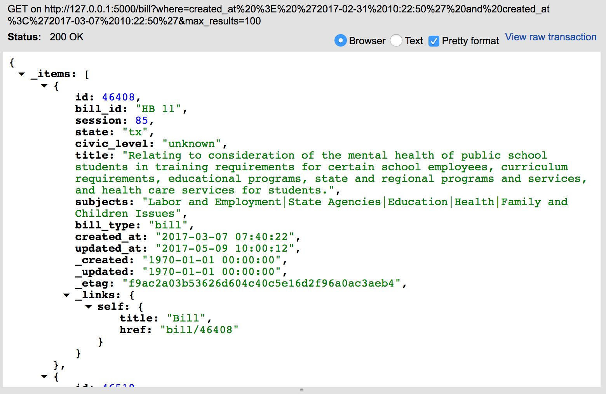
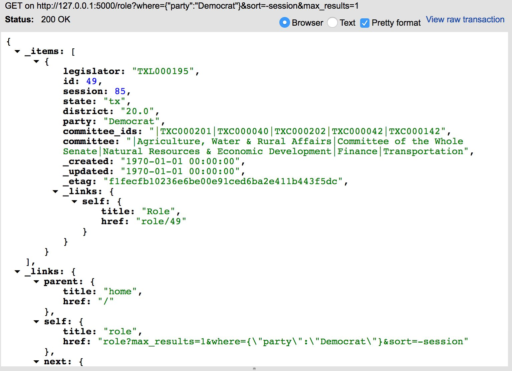

# DATA-ETL
Utilities for importing and manaing data from different sources.

In the python library here, you'll find a mix of simple commands that don't
require you to install the library to your local [pip](https://en.wikipedia.org/wiki/Pip_(package_manager))
or [conda](https://conda.io/docs/) local installation,
but that might be a good idea.

Generally the execution pattern will be something like this without installing:

``./bin/run_local.sh <run_mode> <arguments>``

... or something like this for a run after local installation (e.g. ``pip install .``):

``run_fair_data_<run_mode> <arguments>``

* **parse** - allows you to parse new data
* **summarize** - allows caller to analyze votes by subject/district/session
* **server** - allows you to serve REST-based data queries from the database backend via [Eve](http://python-eve.org/index.html)

# parse
You can parse and ingest new data (as of `0.2.0` just from *OpenStates*) from
a few locations such that the data will be available in an MySQL or sqlite database.

## Using precomputed data
Althogh it may not be the best way to shuttle around data, you can find a
pre-computed [sqlite database](data/fairdata.db.gz).  Don't forget, to use this
file in your own instance, you'll need to `gunzip` it first and then move
it to the base directory of the python repo.


## Importing new data example
1. First, install the package to get all of the dependencies...

``pip install data_etl``

2. Optionally, download the data from [OpenStates](https://openstates.org/downloads/)
3. Then run the parse to ingest new data from the CSV data (in example below).  This
   will parse the first level of an entire directory.  If you provide a file, it will
   parse only the file provided

```
./bin/run_local.sh parse -i data/2017-06-02-tx-csv   (whole directory)
./bin/run_local.sh parse -i data/2017-06-02-tx-csv/tx_bill_actions.csv   (single file)
```

### Where does it run?
As of version `0.2.0`, a conditional `database_type` flag was added to use either a local sqlite
database or the initial group's msyql database.


# summarize
Summaries have been generated at tuples of session, district, and subject (textual).
This table coupling (`district_subjects` and `subject_tags`) allow callers to
(a) discover the relevant subjects as deteremined by legislature, (b) determine
the voting history for each district according to these tags *(added 0.3.0)*,
(c) keywords can also be used directly in the same fashion (with tables `district_words`
and `word_tags` respectively) *(added 0.3.1)*.

## Running summarization
Similar to the parse operation, summarization can be run in two flavors, local or
installed.  The one difference, in comparison is that summaries are computed
over existing data alone and not directly on imported data.  This means that your
database should be fully populated before utilizing the summarize feature.

```
./bin/run_local.sh summarize   (single command, no advanced options now)
```

## Applications of summarization
There are a few use cases that fall-out of the produced tables from summarization.
*Note: It's a bit of of order in this discussion (see [server](server) discussion below
for more information), but included below are web-based calls that could be
utilized for each application.*

1. List the subjects that are found from legislature actions (see `subject_tags`).
   This could be connected to an auto-complete or drop-down in a GUI that allows
   the user to select a number of other properties.  *Note: In the current version
   there **is** case sensitivity for the subjects; words should **always** be
   converted to lower-case.*

```
curl -g 'http://127.0.0.1:5000/subject_tag'  (list all available tags)
curl -g 'http://127.0.0.1:5000/subject_tag/4'  (grab a single specific tag, here 'Housing and Property')
curl -g 'http://127.0.0.1:5000/subject_tag?where={"tag":"Commerce"}'  (grab a single tag)
```

2. In a keyword suggest fasion, see which word maps to which word stem.  Similar to


```
curl -g 'http://127.0.0.1:5000/word_tag/running'  (check out the 'word_id' from this result)
curl -g 'http://127.0.0.1:5000/word_tag/run'  (same 'word_id', neat huh?)
curl -g 'http://127.0.0.1:5000/word_tag?where={%22tag%22:[%22running%22,%20%22run%22,%20%22fly%22]}  (query multiple words to get their word_ids)
```


3. Search by subject to find the voting history for a district.  For a particular
   subject (or number of subjects), attempt to find effects on districts.

```
curl -g 'http://127.0.0.1:5000/subject?where={%22subject_tag%22:[4,22]}'  (search with to tags for district impact)
curl -g 'http://127.0.0.1:5000/subject?where={%22district%22:[2]}'  (find direct impact over all years/tags for a district)
curl -g 'http://127.0.0.1:5000/word?where={%22district%22:[2]}'  (find direct impact over all years/tags for a district)
curl -g 'http://127.0.0.1:5000/word?where={%22district%22:[2]}&sort=-count_no' (what are the most no-vote words for a district?)
```

4. Analyze the voting trends on a single district over sessions.

```
curl -g 'http://127.0.0.1:5000/subject?where={"district":[2], "subject_tag":[4]}'
    (district 2, subject 4; observe votes were only in session 81, 85)
curl -g 'http://127.0.0.1:5000/subject_tag/4'  (grab a single specific tag, here 'Housing and Property')
curl -g 'http://127.0.0.1:5000/role?where={%22district%22:[2],%20%22session%22:[81,85]}&projection={%22legislator%22:1,%22party%22:1}'
    (find the reps who voted in these district/sessions)
curl -g 'http://127.0.0.1:5000/legislator?where={%22legislator_id%22:[%22TXL000185%22,%20%22TXL000260%22,%20%22TXL000503%22]}'
    (confirm overlap of the senator/reps and their total time serving)
```

5. Create a word cloud for words in a district, comparing positive and negative
   (by historical vote correlation).

```
curl -g 'http://127.0.0.1:5000/word?where={%22district%22:[2]}&sort=-count_no&max_results=5' (5 most negative vote getters)
curl -g 'http://127.0.0.1:5000/word?where={%22district%22:[2]}&sort=-count_yes&max_results=5' (5 most positive vote getters)
curl -g 'http://127.0.0.1:5000/word?where={%22district%22:[2]}&sort=-count_other&max_results=5' (5 most ambivalent vote getters)
```
# server
Assuming you have a legit source of data (see above), you can start a simple rest
server to provide data (and answer simple queries) via simple eve server.

## Running eve server
1. Run the server with proximity to the data file (assuming it's in the current dir)

``./bin/run_local.sh server``

2. Go to your nearest server and point to the endpoint you just created e.g. [http://127.0.0.1:5000](http://localhost:5000).
   With this as the testing end point, Eve will list the known data end points.
3. To query the set of votes (just get a whole list), you can simply request that
   [in your browser](http://localhost:5000/votes) or via curl.  Note that the
   return type will vary based on your request header (e.g. XML or JSON).

``curl "http://localhost:5000/votes" ``

4. Want to slice the data ina different way? Check out the [cool set of examples](http://python-eve.org/features.html
   available in the full fledged python sample, or try a query like the one below,
   which will bills found between two date ranges.

```
curl -g 'http://127.0.0.1:5000/bill?where=created_at%20%3E%20%272017-02-31%2010:22:50%27%20and%20created_at%3C%272017-03-07%2010:22:50%27&max_results=100' (bills created between March 1,2017 and March 7,2017)
```

   Or one that will all look at roles a few ways... Note that if you're not using a
   MongoDB database backend, some functions may not behave exactly as expected according
   to the above documentation.  Instead, you can use `python` based notation, like the queries
   below.

```
curl -g 'http://127.0.0.1:5000/role?where={"party":"Democrat"}&sort=-session'  (Democrat members in latest sesssion - reverse sort)
curl -g 'http://127.0.0.1:5000/role?where={%22district%22:20.0}&max_results=100&pretty' (district 20 roles, all results, pretty json)
curl -g 'http://127.0.0.1:5000/action?where=count_other%3E=50' (count of 'other' votes was > 50)
curl -g 'http://127.0.0.1:5000/action?where=count_yes%3E=100%20and%20count_yes%3C120' (count of 'yes' was between 100 and 120)
curl -g 'http://127.0.0.1:5000/bill?where=created_at%20%3E%20%272017-02-31%2010:22:50%27%20and%20created_at%3C%272017-03-07%2010:22:50%27&max_results=100' (bills created between March 1,2017 and March 7,2017)
```

## Screenshots
Below are two examples of the returned JSON.
1. Returning bills in a time range from the time-bound query above 
2. Querying for recent Democrats from the time-bound query above 

